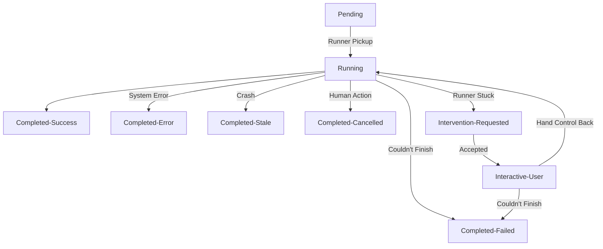

The goal of this system is to be able to drop a small application runner in a private network or remote place that can instrument a modern or legacy application to regularly perform an action or extract information, without requiring a human to hand-craft a set of instructions for that runner.

- [Overview](#overview)
  - [Additional Terms](#additional-terms)
- [Systems](#systems)
  - [Hub](#hub)
    - [User Interface](#user-interface)
    - [Job Coordination](#job-coordination)
  - [Runner](#runner)
    - [Core Loop](#core-loop)
- [Deferred Capabilities](#deferred-capabilities)
  - [Near Term](#near-term)
  - [Mid-Term](#mid-term)
- [Scenarios](#scenarios)
  - [Modes: Training, Trial, Execute](#modes-training-trial-execute)
    - [Training Mode](#training-mode)
    - [Trial Mode](#trial-mode)
    - [Execute Mode](#execute-mode)
  - [Human Intervention](#human-intervention)
  - [DSL: The language of Actions](#dsl-the-language-of-actions)
- [Other Topics](#other-topics)
  - [Application Security](#application-security)
  - [Data Privacy](#data-privacy)

# Overview

There are four major components:

1. **Runner**: a small system that can instrument the interface of an application according to instructions
2. **Hub**: the brain and human interface, managing the training and execution of runners 
3. **LLM**: used during training to understand the screen and devise actions the runner can follow to approach it's goal
4. **Target Application**: the legacy or modern application we're extracting information from (no API available)

There are 3 types of extraction jobs:

1. **Training**: A runner transmits what it can see to the Hub, who crafts prompts for the LLM to select a next step to send back to the runner, until the goals are achieved
2. **Trial**: The adhoc steps from a training run have been compiled into a repeatable recipe, the runner runs that recipe solo to test it
3. **Execute**: A recipe in release mode, the runner is using it with real inputs to extract and deliver real outputs

## Additional Terms

A **Recipe** is what we call the full set of instructions to perform a job against an Application:
- Structure of input values
- Series of Steps to extract outputs
- Recoverable scenarios, detection and steps to recover from things like the adhoc "new feature!" popup
- Structure of output values
- tied to a specific target Application x Customer

A **Training Run** is the equivalent of a Recipe, but for Training mode. The key difference is it continues to extend until Training is complete because we are discovering the path as we go.
- A primary goal statement
- A series of Steps that extends as we go
- Learnings/Hypotheses
  - Input structure
  - Output Structure

A **Job** is what we call one run by a Runner against a target Application.

A notation of **(FUTURE)** indicates scope that is deferred for the first POC stage of development of this system. These are high-confidence additions, so they are included to surface them for alignment as design is implemented during this POC stage.

# Systems

## Hub

The Hub serves as the administration interface, the coordinator of jobs and runners, and the orchestrator during training runs.

### User Interface

(sample screenshot)

The User Interface enables a user to:

1. Manage Customers, stay aligned with becoming a multi-tenant system (FUTURE)
    - View a Customer's details, registered Applications & Recipes, registered Runners, recent Job history and Job's requiring human intervention
    - (FUTURE) Create/Update/Retire are currently not implemented at this POC stage
    - (FUTURE) Scoped RBAC: access limited by role and granted customer list only
2. (FUTURE) Manage Applications, creating a catalog so recipes learned for one Application and Customer can be used or inform recipes for another
3. Manage a Registered Application
    - View the list of registered Runners for this Customer x Application, heartbeats/status, current activity (running job X, idle)
    - View the recent Jobs executed, the latest Recipe versions
      - Draft row displays at the top with a "Start Trial" button, which opens a modal for necessary inputs (see [Trial Mode, Step 1-2](#trial-mode))
      - Released Recipes display next, newest first, with a "Start Job" button, which opens a modal for necessary inputs (see [Execute Mode, Step 1](#execute-mode))
    - Begin a `Training Run` job: modal to enter required information (see [Training Mode, Step 1](#training-mode))
    - (FUTURE) Scoped RBAC: access limited by role and granted customer list only
    - (FUTURE) Create/Update/Retire are currently not implemented at this POC stage
    - (FUTURE) Register new Runners, linking a Customer to an Application to a Runner configuration 
      - _Note: The database design aligns with this, but no UI capability is planned at this stage_
      - _Note: A single runner is pre-registered in the system for this stage for a single predefined Customer and Application_
4. Manage Jobs
    - View all jobs
    - (FUTURE) Paging, filtering, search
    - (FUTURE) Scoped RBAC: access limited by role and granted customer list only
5. Job Screen
    - Stage, status, recipe, Target Application, Customer, and other job details
    - Transcript: informational logs and logged Steps the Runner has taken
    - Results: the structured outputs that were collected
    - Export: Download a JSON file with these details
    - Human Intervention: if a Runner is running and raised a problem, a human can intervene to drive and get it back on track
      - This is a screen overlay, see details in [Human Intervention](#human-intervention)
6. (Future) Home Dashboard
7. (Future) User Administration

### Job Coordination

The Hub manages Jobs through a series of stages:

State definitions:

* `Pending`: the job is created an waiting for pickup
* `Running`: the job has been picked up by a Runner
* At this point several things can happen:
  * `Completed-Success`: The job is completed successfully (including conditional cases like "Page not found" extracting as a specific value) and data has been extracted
  * `Completed-Failed`: The job could not be completed successfully (Business logic failure)
  * `Completed-Error`: An unexpected error has occurred that cannot be corrected (Technical failure: Bug in the code, Allowlist blocks necessary navigation)
  * `Completed-Stale`: (FUTURE) the Runner has disappeared long enough (or reconnected and not continued the job) to consider it crashed 
  * `Completed-Cancelled`: The job has been cancelled in Hub and should not be continued
  * `Intervention-Requested`: "I'm stuck, help"
* `Intervention-Requested` is a halted, non-terminal state waiting for a user to take control
* `Interactive-User`: the user has taken control and is issuing Steps/Actions, until they either get the Runner back on track (`Running`) or give up (`Completed-Failed`)

All `Completed-*` steps are considered terminal. If a Runner asks for status or reports progress on a terminal Job they will be notified to halt.

`Completed-Failed` and `Completed-Error` states include additional structured details from the runner, such as Playwright selector details, browser error stacks, internal error stacks, a final screenshot, with sensitive data masked.

**Job Ownership**

When a Runner asks Hub for a job, Hub performs an atomic operation to find the next available job that Runner qualifies for, immediately stamping it with the Runner's unique id, a start time, and a heartbeat time.

On every subsequent call to Hub to update or access this job, it authorizes that call against the runner id assigned to the job and only allows that assigned Runner to access it.

Every Runner has a unique id that is generated and saved to it's local settings when it is registered (or in the short-term since we are seeding this data, when it is seeded). This unique id is part of the authentication mechanism for all API calls from Runner to Hub.

(FUTURE) Ability to enhance authentication to require access by a Runner come from a specific IP Range, include a specific fingerprint from the machine it's running on, etc.
(FUTURE) Consider Runners connecting from ephemeral systems without duplicating the id.

**Job Retries**
- (Future) A job can be retried, this clones the original job to start a fresh run
- (Future) `Completed-Stale` could automatically queue up a retry job for `Execute` jobs, with a limit and certain criteria (examine the prior transcripts of the crashed run for irreversible actions already performed, for instance). This is monitored to determine if a Recipe is flaky, if many Runners of a certain type across different Recipes are flaky, etc. with appropriate alerts raised

## Runner

The Runner is designed to be able to drop into a controlled environment and interact with a certain class of apps. It is registered to a customer and application, so it can only pick up jobs that are relevant to it. It's goal is to follow instructions to extract structured data from an application that does not have an API, without leaking security or sensitive data unintentionally.

On start, the Runner connects to it's configured Hub URL:
- It's verified as still configured/active
- It receives the address to poll for Jobs and the timeout to wait (in seconds) during human intervention

### Core Loop

- Poll for a job
- Accept a `Training` Job
  - Payload: starting step (open URL), allowlist, screenshot masking disable setting, schema version number
  - Acknowledge job received and schema validated
  - Open the indicated starting URL
  - Report success at the first step and send a screenshot, ask for next step
  - Interactive Loop
    - wait for new Step to be available at Hub for Job
    - execute the step
      - identify if there's a better selector to use (broadly: translate from "click x,y" to "click button labeled 'Search'")
      - if data is being extracted, identify if it's sensitive
    - report success and send a screenshot, selector info, sensitive field info, field value as relevant. ask for next step
    - Repeat until the next step is "Finished" (no checkpoint condition expected) or job status is terminal
  - Report Job `Completed-Success`
- Accept a `Trial` or `Execute` Job:
  - Payload: 
    - Recipe: structure of expected inputs + names/tokens, steps for data extraction w/ off-ramps, array of recoverable scenarios
    - Ingredients: the Customer-specific & Job-specific input values
    - Controls: allowlist values for URIs
    - Comms: the callback URLs to send status, artifacts, etc to Hub
  - Acknowledge job received and validated
  - Automatic Loop
    - Track the automatic step that is starting
    - Execute a step of the Recipe: Go to a URL, interact with the screen, extract and map a value for result, etc.
    - Recoverable scan: Check entry criteria for each recoverable step to see if it's present/necessary
      - if so, run the recoverable steps
      - If a recoverable step indicates to report failure, Report `Completed-Failed` with details and exit job
    - If a "Finished" step (including checkpoint conditions), Report `Completed-Success` and exit job 
    - If a step fails and there is no recoverable step available, Report `Intervention-Requested` and switch to the Interactive Loop
    - If a step times out (Recipe setting), Report `Intervention-Requested` and switch to the Interactive Loop
    - If an unexpected error occurs, Report `Completed-Error` with details and exit job
    - If an allowlist violation occurs, Report `Completed-Error` with details and exit job
  - Interactive Loop (`Intervention-Requested`, see [Human Intervention](#human-intervention))
    - Keep the same browser session open
    - Wait up to X seconds (settings from Hub initial call, restarting as an idle timeout once a human takes control), if human intervention has not occurred or goes idle then report status of `Completed-Failed` with details of the timed out wait and exit the job to look for new work
    - As user steps are received from Hub, they are executed and the additional details for Human Intervention mode are provided
    - This continues until either the user sends a recovery action, the job status changes on it's own, or a non-recoverable error occurs:
      - -> non-recoverable error: same logic for `Completed-Error` above
      - -> Recovery action: if the user specified a step, update the automatic step tracking, report `Running`, return to the Automatic Loop
      - -> Status change: if it's a terminal state, follow the general process below to exit. If it's non-terminal, report `Completed-Error` with an error message about an unexpected status change and exit.
    - If an unexpected error occurs, Report `Completed-Error` with details and exit job
    - If an allowlist violation occurs, Report `Completed-Error` with details and exit job

When exiting a job, the Runner cleans up any temporary resources it collected during that job.

At any point, if a job is in a terminal state, then when next Runner calls with status updates or to get information on the job, Hub will respond with that updated status and Runner will exit the job and return to waiting for new jobs.

**Notable Specifics**

1. Each communications to the Hub is structured and will be visible within the Job Transcript.
2. Screenshots can contain PII and other sensitive data. Prior to taking a screenshot, the Runner has two methods for identifying sensitive data: provided credentials and using a third party library to identify sensitive data on the screen. The data is masked with tokens prior to sending the screenshot to Hub.
   1. If Training Mode indicates Masking is disabled (requires a guarantee the Application is using non-sensitive or synthetic data), only the credential values are used for masking, without the third party library detection.

# Deferred Capabilities

## Near Term

- Human Intervention -> Improved Recipe: if Human Intervention is necessary, the ability to take that Job and the intervention steps and plan improvements automatically to the Recipe that incorporate what was learned from the Intervention
- Application catalog: A catalog of all available Applications for copying/correlating working Recipes for re-use across customers
  - Recipes are not automatically used or usable across customers, rather they are available to be evaluated and cloned for that use (with correlation to consider future "if I change the recipe for Customer 1, should it also update for 4-33, maybe with human pressing an ok button)
- Non-Web Runners: Desktop app support, access to a robot with a camera and an arm on Mars
- Customized output structure: Ability to define a specific structure for output data (instead of flat JSON)
- Tabular extraction: Ability to extract tabular data (an array of values)
- Data Retention Expiry: Automatic and forced expiration (deletion) for Screenshots and Transcripts within Hub

## Mid-Term

- Multi-Tenant: will support partitioned Customer records. Applications can be registered to a Customer, Users can be restricted to only see certain Customers, etc.
- Users and User Authentication: Adding user records, user management, authentication
- User Authorization: Scoped RBAC to manage user's access to general administrative capabilities as well as slices of the Customer records
- Email/Alerting: A faux-communications method is available in the backend to output to console, email/slack/etc would replace this later
- Runner Registration: A registration loop where a new runner is started with a code, a user must accept that registration in hub, to prevent bad actors from trying to register their own runners and extract information
- API-triggered Jobs: Ability for a customer or service-on-behalf-of-a-customer to call and create a job with a webhook location to report the outputs/status when ready
- Scheduled Jobs: Create a schedule and batch of inputs to generate jobs regularly
- Runner WebSocket/SSE/Long Poll: for faster response time to LLM and human generated actions during Jobs instead of plain HTTP polling

These operational capabilities are deferred:
- Error Reporting: Sentry or similar on Hub, Runner errors routed back through Hub to Sentry or similar
- Evals: Regular scheduled testing of prompts embedded in Hub
- Observability: Application & LLM observability for Hub
- Monitoring: Health, bug, incident alerting for Hub, pattern-based incident alerts for Runners
- Pre-Production & Production Environments, Delivery process & pipelines, IaC, etc.

# Scenarios 

## Modes: Training, Trial, Execute

### Training Mode

In `Training` mode, the system is learning how to achieve it's goals.

- Primary Goal: extracting the data the user asks for
- Alternate Goals: identify recoverable situations that show up during this process

1. Starting Training
   1. The user explains the goals and the fields they are trying to extract, this is the primary goal
   2. The user also provides the URL to open, which is also used to seed the allowlist
   3. The user specifies a maximum number of steps
2. The runner runs the first step and then loops
   1. After running the step, collect and send details to Hub: 
      1. screenshot (masked)
      2. if action included selectors, then suggestions for better selectors (Click button label="ABC" instead of Click x,y)
      3. if action included data extraction, data value and indicator if it's sensitive
   2. Hub receives the step detail
      1. Adds it to the Transcript
      2. Identifies if the maximum number of steps has been hit:
         1. If so: since we're not at success state, update status to `Completed-Failed`. This stops job processing and the runner exits it's current loop at terminal states to look for new jobs.
         2. (FUTURE) add a state to pause the run and ask the user if they want to extend the run (more steps), mark it as failed, or treat it as successful (maybe the primary goal is complete and it was grinding on secondaries)
      3. Sends the summarized transcript so far, the screenshot, the user goal, the alternate goals, and the Step DSL to the LLM
      4. The LLM responds with the next step for the Runner: Actions, reasoning/intent, suggested names for output fields if part of the Actions
      5. (FUTURE) If the step is deemed irreversible, pause the job with status `Approval-Requested` with a communication and wait for human approval to continue from the Job screen
   3. Hub appends the new Step to the Training Run or an explicit "Finished" step (no checkpoint condition needed) if it's done
   4. Runner picks up the addition & executes the step (goto 2.1), if it's "Finished" it will report a final `Completed-Success` and exit the job
3. On `Completed-Success`, Hub changes the job status as usual, but then also builds the `Trial` recipe:
   1. Compile a system prompt, the goal prompt, LLM steps provided, Transcript of actual execution and send it to the LLM to structure a recipe from (may happen over multiple prompts)
   2. Save a new draft Recipe for this Customer/Application and notify users that a new `Trial` run can be started with the new Recipe

### Trial Mode

In `Trial` mode, the goal is to validate the recipe from `Training` mode before promoting it for regular `Execute` use. This is effectively a draft + publish operation. The Training job has produced the `Trial`/Draft recipe and announced it to users.

**Run:**

1. User opens the Hub's Registered Application screen
2. User taps the "Start Trial" on the draft Recipe
    - User is presented with the steps
      - Steps identified as having irreversible actions by the LLM during post-Training creation of the Recipe will be marked as such
      - (FUTURE) Ability for the user to edit or send a Recipe back for recreation if an irreversible step isn't necessary
      - (FUTURE) Ability for the user to cut scenarios from Recoverable Scenarios if they have irreversible steps that shouldn't be allowed (would result in a job going to Human Intervention for an unhandleable situation instead of dynamically using that scenario)
      - The presented steps are the only allowed steps once in Trial and Execute mode, so the user is reviewing and acknowledging this
    - User provides necessary inputs for trial run: URL for starting step and allowlist, plus any others required
    - User taps "Start Trial"
3. `Trial` runs effectively like `Execute` from here
4. When the `Trial` is successful, a communications is sent to the User to indicate it is ready to be promoted/released

**Promote:**

A draft Recipe is eligible to publish only when a Trial Job of this exact Recipe completed successfully.

1. User opens the Hub's Registered Application screen
2. In addition to "Start Trial" button, the draft recipe now has a "Publish" button too
    - When tapped, the Publish button toggles the Recipe from draft to published
      - display a modal for the user
      - User identifies if this is replacing a prior published recipe or a new one (dropdown)
      - User enters/edits a name for the recipe (populated by default if a prior recipe is selected)
      - User taps Publish, this recipe is linked to the prior recipe (if selected) and the prior recipe is archived (no longer available from Start Job menu)
        - (FUTURE) a common parent id would allow the future/non-existent API to choose between using a specific recipe or the latest published version (same parent id, not archived)
    - The next job created for this Customer x Application will include this latest published Recipe in the list

### Execute Mode

In `Execute` mode, the Recipe is ready for use to extract one or many jobs worth of data out of the target Application for this Customer.

1. Hub: a Job is created for a Registered Application (Customer x Application)
   1. The latest published Recipe is selected or is specified by the actor scheduling the job
   2. Required inputs are provided and validated against the Recipe
   3. A Job entry is created in `Pending` state
2. Runner: the runner receives the job and runs the [Core Loop](#core-loop), reporting INFO, STEP, and status changes back to Hub
3. Hub: 
   1. stores transcript details as they arrive
   2. communicates errors, failures, intervention requests to the user

No LLM usage in this mode.

## Human Intervention

Human Intervention applies to Recipe Jobs only; Training Jobs stay Hub-authoritative and never enter it ([DEFER 10](./docs/defers/0010-training-job-intervention.md)). When a Recipe Job is `Intervention-Requested`, a user can open the affected Job and press a "Take Control" button. The goal is to direct the Runner through additional steps that either return it to the Recipe Steps so it can continue, or end the job as `Completed-Failed`.

When a Human uses the "Take Control" button, an atomic update is applied to the Job Status (`Interactive-User`) and stamps a client-generated `operatorId` on the record, only if the status is still `Intervention-Requested` and no owner is set. There is no auth, so `operatorId` is an ownership token that prevents mixed signals to the runner, transcript, or LLM, not a security boundary. The Runner keeps its browser session open, and its intervention timeout restarts as an idle timeout once control is taken. This information is added to the Job Transcript as part of the status change.

Each Human Intervention command is included in the Transcript. Commands are not persisted as Recoverable Scenarios. A future addition will enable Hub to take the Transcript and Recipe and use the LLM to fashion a new draft ([DEFER 3](./docs/defers/0003-intervention-to-revised-recipe.md)).

1. An overlay opens that displays the Human Intervention panel, locked to the owner
    - Displays the blocked Step and reason
    - Latest screenshot of where the runner is right now
    - Transcript of recent actions
2. The owner has three ways to perform an action, one command at a time (a single pending command per Job that the Runner pulls, see [ADR 0005](./docs/adrs/hub/0005-operator-command-wire-protocol.md)):
    - Click the screenshot to communicate a "Click x,y" Action
    - Type a prompt that Hub converts, with one LLM call on explicit submit, into one atomic Step: "Read the value out of the such-and-such label as output `acct_no`"
      - (FUTURE) The step is displayed to the user prior to being added for the Runner to pick up, allowing them to explicitly approve in case it is an irreversible action
    - Assign an output directly: `acct_no=null`
3. Note: Before accepting a command, Hub verifies the job status is still `Interactive-User` and this operator is the owner (for instance, ensuring a cancelled job doesn't get toggled back since the Runner will have moved on). A command still pending when the Job leaves `Interactive-User` is voided.
   1. (FUTURE) Surface the acknowledgment from the Runner picking up the new step in the transcript to the overlay, then use the inverse (it's been X seconds since posting the step and the runner hasn't picked it up) to detect if the Runner is no longer connected and has gone stale
4. When ready, the owner hands control back to the Runner, selecting the Recipe Step to resume at. Hub validates the position and the Runner resumes there, so readiness is proven by the resume Step running. The owner can instead end the Job as `Completed-Failed`.

(FUTURE) At any time if the Job status changes away from `Interactive-User` while this user is in the screen or the user id on the Job status does not match their id, the overlay locks with a message indicating the new job status or that Human XYZ is now in interactive control instead.

## DSL: The language of Actions

TODO

# Other Topics

## Application Security

**Customer Application Security**

- The Runner is the only one with credentials to the Customer Application
- The credentials are used as part of the sensitive data detection for masking

**LLM Security**

- LLM access is only from the Hub, never from Customer-accessible systems (the Runner)

**Runner Registration**

- (FUTURE) Runner Registration ensures two actions must be taken (Runner-side, Hub-side) before a Runner can access any information for a Customer x Application

## Data Privacy

Two layers of Data Privacy:

1. Hub
   1. Training Mode operates on screenshots with an option to use less masking if a Pre-Production/Synthetic guarantee is made form the Customer
   2. (FUTURE) Using the results of [Human Intervention](#human-intervention) to produce an updated draft/Trial Recipe will additionally include using sensitive data classification on the inputs and outputs to mask data before sending transcripts and screenshots to the LLM
2. Runner
   1. Screenshots: the Runner evaluates the content on the screen for sensitive data and masks it before screenshots are sent
   2. Output Fields: sensitive outputs are identified by the Recipe in advance and expected to be sent to Hub as part of the normal execution of the system
      1. (FUTURE) Consider Customer-keyed encryption of outputs on Runner before transmission
