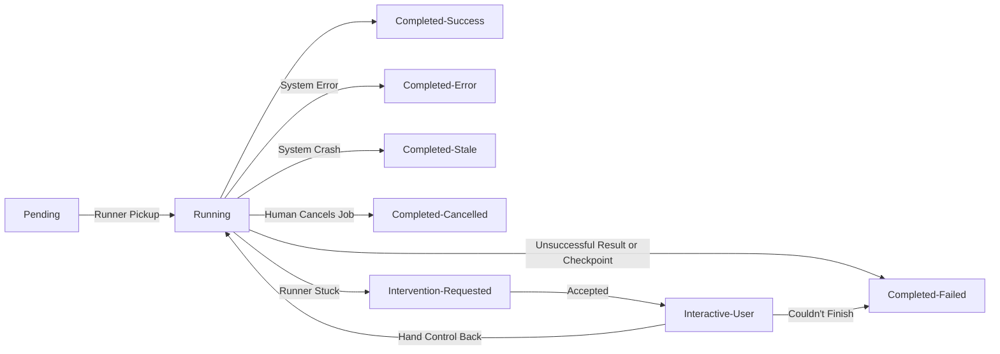

# Computer-Use Automation

## Architecture

This system learns how to automate a remote system that does not expose an API. The LLM model explores the system during Training to achieve goals, then again to convert that journey into a repeatable Recipe with defined Ingredients. The resulting typed, Recipe runs through an approval and Trial run process before being published for endless replay, with no LLM in the loop. Layered controls for sensitive data ensure customer credentials, inputs, outputs, and sensitive on-screen information follows clear policies for masking and transmission.

The system includes 5 key actors:
- **Runner**: Operates one Customer's Target Application from inside its network. Holds the application credentials, executes validated Steps, performs data masking, and has no model credentials or access to other Customer's information.
- **Hub**: Stores Recipes and Jobs, coordinates Training, manages outputs and masked artifacts, serves the operator UI.
- **LLM**: Used for understanding state and identifying next steps towards a goal
- **User**: Provides direction, oversight, and intervention when needed
- **Target Application**: A local BambooInvoice installation representing a legacy application without API access

### Key Decisions

| Decision                    | Reason and trade-off                                                                    |
|-----------------------------|-----------------------------------------------------------------------------------------|
| Hub and Runner services     | Security: Customer credentials stay in network, LLM access & keys stay in ours          |
| .                           | Heterogeneity support: One Hub, many Runners keyed to specific Customers x Applications |
| .                           | Safety: Customer sensitive data managed close to the source                             |
| .                           | Trade-offs: more coordination and software to support than a single process             |
| Runner polling              | Works through customer network boundaries and supports disconnected/busy Runners;       |
| .                           | Trade-off: intervention responds more slowly than a persistent connection.              |
| Minimal Job Queue           | Decouple Job lifecycle from system uptime, better visibility; more coordination & parts |
| DSL for Steps               | Strong, shared definition for communications, training, validation, and driving agents  |
| TypeScript, SvelteKit, Node | Familiar, batteries-included, typed stack for delivery speed and reduced token usage.   |
| SQLite                      | Realistic persistence, simple to implement, closer-to-parity integration tests          |
| .                           | Trade-off: unsuitable for production (multi-instance, zero downtime deploy) without replacement. |
| Playwright                  | Strong web automation and locator support; does not support desktop applications.       |
| OpenRouter                  | Allows model comparison and budget control during Training.                             |
| BambooInvoice               | Local, realistic legacy web app that offers full control and synthetic data seeding     |
| .                           | Trade-offs: an additional developer dependency (docker/podman), setup time              |

## Artifact Schema

### Recipe

A successful Training Run produces a typed, versioned, reviewable draft Recipe. The Recipe is a separate artifact from the Training Run, linked for provenance. 

A Recipe includes:

- `inputs`: named fields with type and sensitivity
- `outputs`: named fields with type and sensitivity
- `steps`: ordered DSL actions, targets/selectors, and conditions
- `recoveries`: array of conditions and Steps for known interruptions
- `schemaVersion`: DSL compatibility version
- Hub metadata: identity, revision, status (draft, published, archived), goals, audit dates and FKs

The typed Steps DSL is shared by the Hub, Runner, and Training mode communications with the LLM. Strongly defined actions, conditions, and targets are used to direct model output, strictly validate it, present readable output for human review, and keep Recipes independent from one Runner's implementation details (Playwright, in this case). 

The DSL is [limited](./docs/todos/supporting-docs/steps-dsl.md) in this version intentionally, but built with [extension in mind](./docs/todos/supporting-docs/steps-dsl-extended.md).

Recipe, Job Inputs, and Job Outputs are transmitted as JSON. Hub stores Recipes as JSON in the database, as it retrieves them as a single immutable unit and does not query their internal structure.

**[Example Recipe](#)**
```json
TODO: cut an example from the seeded Recipes once merged + export button is added
...truncated
```

- [How a Runner processes a Recipe](#)
- [How Hub works with the LLM](#)
- [How Human Intervention translates to Recipe Steps](#)

### Ingredients (and Controls)

Each Job supplies Ingredients containing the Recipe's named inputs, starting URL, and URL allowlist. This separation between Ingredients and Recipe allows the immutable Recipe to run repeatedly with different values.

## Determinism & Error Handling

The two core elements for how this system approaches determinism are a clear Job status flow and the training/draft/publish flow for Recipes. Every Job produces a Transcript, a structured record of what the model, Runner, and operator did and why, with details and masked screenshots included during Training Runs and error scenarios requiring debugging.

### Job Status Flow

A Job is created and is run until it meets certain exit conditions. We make those paths explicit and assign specific terminal states that reflect the difference between a business failure, a system error, a cancellation, and a success. Human intervention is baked in, synchronizing the visible Job state for a user to strongly partitioned runtime logic in the Runner.



### Training Run -> Trial -> Repeatable "Execute"

**Train**: The Training Run is exploratory; the LLM is goal seeking in this mode. It is running an observe, decide, act cycle to reach the goal the user has selected, and some sub-goals we have provided, by analyzing the results of each Step it takes, until it reaches the step budget set by the user at the beginning of the run. 

**Trial**: Once a Training Run is successful, the LLM is led through a re-processing phase to identify a short successful path for the Recipe, alternate conditional Steps (detecting and handling "Not Found", for instance), any series of events that appear to be a one-time recoverable sidetrip, and setting the final conditions or checkpoint to consider the goal reached successfully. These become the Trial Recipe. The user reviews the trial recipe for approval and begins a Trial Run, which runs the first replay without a model in the decision loop.

**Execute**: A successful Trial Run presents the user with the option to publish the Recipe as a new Recipe or replacement version for an existing one. Once published, the Recipe is available for "Execute" job runs, which will replay that Recipe one, ten, or hundreds of times, as needed.

The Steps DSL is strict about the actions that can be taken:
- [Clear, specific condition Steps](./docs/todos/supporting-docs/steps-dsl.md#conditions)
- [Defined actions](./docs/todos/supporting-docs/steps-dsl.md#actions)
- [Specific, differentiated targets ](./docs/todos/supporting-docs/steps-dsl.md#targets-and-values)

And mapped strictly by the Runner to specific execution instructions (ex: [actions.ts, ln118](./src/runner-web/browser/actions.ts)).

### Unexpected Scenarios, Errors, Failures

The Job flow and Trial->Execute progression connect to explicitly support both the plotted happy path run, as well as any other scenarios that arise.

| Scenario                        | Handling                                                                                  |
|---------------------------------|-------------------------------------------------------------------------------------------|
| Expected states ("Not Found")   | A conditional case and "goto" in Recipe Steps keeps this on track for `Completed-Success` |
| Recoverable condition           | Recipe recovery scenarios are used, keeps this on track for `Completed-Success`           |
| Failed Step                     | Calls for assistance, `Intervention-Requested`                                            |
| Failed checkpoint               | A necessary value or end state is missed, `Completed-Failed`                             |
| Blocked Navigation (allowlist)  | `Completed-Error`, this Job cannot proceed and the Recipe may need attention              |
| Blocked sub request (allowlist) | Recorded in the Transcript; the affected Step may subsequently fail                       |
| Runtime/Hard failure            | `Completed-Error` with details or a masked screenshot                                     |
| Runner system crash             | Remains `Running` until cancelled; `Completed-Stale` implementation is deferred           |

## Heterogeneity & multi-tenant

The DSL separates Recipe intent from the Runner's individual implementation. An alternate web application implementation would support the same DSL translated to its own implementation or constraints. A runner for a Desktop application would either share a common core of the DSL for forked specific web/app extensions or a parallel DSL, while still using similar LLM prompts, producing similar english descriptions for easy approval, and integration to the same Human Intervention mechanisms. `schemaVersion`, Runner capabilities, and Application registration make incompatibility explicit.

Recipes belong to a single Customer x Application. A future Application catalog could correlate these individual copies to offer an option to copy and Trial run across Customers, or present curated "golden" Recipes. Copies remain independent but carry provenance, enabling controlled Trial and rollout to Customers, minor adaptation of curated Recipes for specific Customer conditions, and independent test and review cycles that match Customer requirements and scheduling, if needed.

## Escalation & Handoff

A Runner requests intervention when it is "Stuck"; a Step cannot be performed due to the screen or system being in a different state then expected and no Recoverable Scenario can resolve it. The Runner signals a Job status change to `Intervention-Requested` and waits for human intervention. It retains the live session, pausing for direct instructions.

(TODO: screenshot)

The Intervention dialog on the Job Screen provides a user with controls to direct the Runner. The user attempts to get the Runner back on track so they can cede control back, or determines the Job cannot be completed and sends a signal to explicitly fail to `Completed-Failed` before existing the session. Every action and change of control is explicitly logged in the Transcript.

Control is exercised through Steps. The user can click the latest (masked) screenshot to send a "Click on x,y" Step to the Runner or enter a prompt for more complex behavior that an LLM translates into validated Steps for Hub to provide for the Runner. The Runner, while in Intervention mode, waits for these intervention Steps or a signal for status change. The signal to return to automated run mode can include a specific step to start back on as it leaves manual mode and returns to the Recipe Steps.

(TODO: add a link to the context doc once merged)

## Safety

- **Network**: all navigation and API calls by the browser must pass the configured Allowlist or be denied
- **Actions**: Runner accepts only the typed DSL, a human reviews a draft before its first Trial
- **Credentials**: Model credentials stay in the Hub, application credentials stay with the Runner and are masked from screenshots and Transcripts
- **Sensitive values**: Hub stores declared inputs/results separately from their masked display values; no access to raw values for default paths
- **Screen Data**: Runner uses configured values and a detection library to mask sensitive screen content
- **Known limitation**: Intervention model Steps are not previewed, irreversible Steps are designed but implementation is incomplete

## Cuts

This lists the cuts made against the requirements and a few notable other places I intentionally went shallow within my own architecture choices.

| Cut / Limitation                          | Next Step                                                                         |
|-------------------------------------------|-----------------------------------------------------------------------------------|
| URL policy, 1 origin match only           | Add route pattern options and Hub user capability to manage additional policies   |
| Action policy limited only by DSL         | Add user-defined Action policy to Training/Recipe Jobs for fine-grained control   |
| Intervention LLM Steps run w/out approval | Display the LLM generated Step for user approval ("is this what you meant?")      |
| .                                         | before transmitting to the Runner                                                 |
| Recipe iteration from Intervention        | Add capability to send a Recipe and Transcript of a Human Intervention through the|
| .                                         | LLM Recipe drafting flow to propose additions to `steps` or `recovery` scenarios  |
| Training Steps run w/out approval         | Decide w/ product & security whether training Steps require human-in-the-loop or  |
| .                                         | if synthetic-only customer environments for Training is something we can require  |
| Irreversible-action handling incomplete   | LLM-classification of Risky Steps during Recipe creation, with human override     |
| .                                         | before publication and explicit validation during Trial runs                      |
| Stale Runner/Job detection                | Add Hub monitoring that marks abandoned Jobs as `Completed-Stale` automatically   |
| .                                         | and produces a retry Job if no irreversible Steps were reached                    |
| Runner is pre-registered                  | Add an explicit Runner registration process (human approval on both sides) before |
| .                                         | Runners can accept Jobs for a customer, access details, or send information       |
| Limited evaluation of LLM choice          | Perform structured experimentation, add evals for ongoing testing, s/yolo/science |

