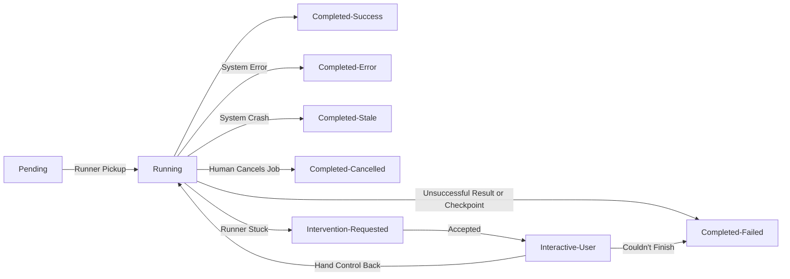

# Computer-Use Automation

## Architecture

The goal of this system is to easily train automation to pick data up from a customer's system that can't otherwise be surfaced through an API. An LLM is used in the training for speed and efficiency. We are sensitive to privacy and other regulatory classifications that may apply to data and screens on the Customer system. We have customers with 10s of apps, and 100s to thousands of customers. And of course automation breaks as systems change, so we need ways to get it back on course.

(small draft)

There are 3 systems:
- **Runner(s)**: A small runner within the Customer's network, pre-registered to their Customer record in our system and a platform-wide Application. Access only to the credentials the customer gives it, none of our orchestration or training logic, no LLM access on our bill, and no risk of access to other customer's data.
- **Hub**: The UI we work with, the orchestrator between the runner and LLM or Human Intervention session, and the job queue for repeating pre-trained recipes
- **Target Application**: A sample application for test purposes, an abandoned invoice system

### Key Decisions

- Hub and Runner are separate systems to:
  1. Security: no LLM access/keys in the hands of the customer, no customer credentials outside their system
  2. Multi-tenant and Heterogeneity alignment: a single Hub, many runners keyed to specific Customers and Applications
  3. Data Safety: sensitive values from the customer app are barred from leaving except in specific conditions, data from the LLM is forced to meet contracts before being applied near the Customer system
  - For a trade-off: more complexity and work, to meet requirements that could have been on the cut list instead
- Runner polls for work: allows for scaling patterns if data jobs need to run in parallel that can be managed at the edge, instead of centrally, less coupled to each others runtime during updates, and simpler control scheme than a centrally managed hub with persistent assignments and connections
- Minimal Job Queue (below): the runner may not be running yet, it may already have another job, provides control to cancel an in-progress job and future support to detect stale (crashed) runners
- A nice UI, for the Job screen at least: Less work than it may look like, given some experience with Claude Code and producing workable SCSS and Svelte components from it, and it helped flesh out the technical architecture and design through the lens of "How would a human do these activities", but it did pull in some extra trade-offs on time in a couple cases where relatively light looking adds on the screen were more work than expected (masking sensitive fields in the Transcript with styled markup, for instance)
- Minimal authentication is in place between the Hub and Runner as an example stand-in, no authentication or user management is in pace on the Hub. This was a trade-off for less work on areas that I felt were far enough away from the core problem that a representative was enough to show the consideration was there, without a full implementation.
- Technology selections:
  - SvelteKit, TypeScript: fast, batteries-included framework with a small footprint (speed, token efficiency, review readability) plus typing from TypeScript
  - SQLite is lightweight and similar to what we would pick for a real implementation, without a server requirement, without writing my own file management layer, and keeps integration tests 1:1 for fast feedback loops with low additional scaffolding
  - Playwright was selected because it's been my primary pick for web test automation for several years, bringing speed of comprehension, familiarity, fit for this use case, but trading off against tooling that may have allowed more generic integration to desktop apps as well
  - Claude Code was selected for Agentic coding, from 3 I've used recently, because I had skills and some context setup I could pull from a much further along personal project to get up and running fast
  - LLM Provider: OpenRouter was selected to make it easy try different models and have strong control over the budget while experimenting and testing
- Target App Selection: BambooInvoice turned up through some internet searches of older business platforms, and the trade-off ended up being negligible versus my other front runners (read data from my printer web page, from a sample project from 15 years ago I already had) because an Agent made quick work of figuring out how to get it working in containers, what versions of MySQL and PHP could be used, extra flags to flip, etc for a much more polished developed experience, end-to-end test automation experience, and realism

### Runner Process

A Runner uses a prepared Recipe (Artifact Schema) or incremental Steps during Training to determine the work it is doing. It reports status changes and Transcript entries back to the Hub as it works on the job. As outputs are identified and extracted, it reports these as well. On reaching a terminal state or receiving notice of a terminal state after sending data to the Hub, it cleans up all temporary data and assets and exist the job, polling for the next:



## Artifact Schema

### Recipe

A successful trained run produces a Recipe:

- `inputs`: fieldname, type support, sensitivity
- `outputs`: same
- `steps`: a DSL for actions, selectors, and conditions
- `recoveries`: an array of Recoverable Scenarios, conditional checks with steps to take to recover
- `schemaVersion`: future aligned, support making breaking changes withotu having to update all runner immediately to speak the enw language
- And values private to Hub: 
  - `id`, `createdAt`, `publishedAt`, `recipeStatus` (draft, published, archived), `name`, `goal`, ...

The Steps DSL, also used for the Recoverable Scenarios (`recoveries` property) is used by the LLM, Hub, and Runner. This provides a shared language that can be used to constrain LLM output to a valid subset of activity, be communicated to an end user for review and approval in simpler, non-technical language, and is decoupled from the runner's implementation so upgrades or changes continue to meet a contract and not an implementation from another system. The set of steps is intentionally [limited](./docs/todos/supporting-docs/steps-dsl.md), but built with [extension in mind](./docs/todos/supporting-docs/steps-dsl-extended.md).

Inputs and Outputs are structured so they can carry information about their sensitivity for data masking and be referenced by consistent name when communicated. A Transcript can be easily generated from a keyed name of "acct-number" to display the masked value in the UI, but used in secure usage as a field with the raw, non-masked value, without drift.

Data is transmitted in JSON, instead of a custom format, and stored in the database as text since there's no intent of doing complex logic or conditions on it in the database.

**[Example Recipe](#)**
```json
TODO: cut an example from the seeded recipes once merged + export button is added
...truncated
```

- [How a runner processes a Recipe](#)
- [How Hub works with the LLM](#)
- [How Human Intervention translates to Recipe Steps](#)

### Ingredients (and Controls)

If the Recipe tells us how to bake the cake, the Ingredients are the cake we are baking today.

Ingredients are sent with the Job next to the Recipe:

- `controls.allowlist` - what URLs are allowed during this job run
- `startingURL` - every job has an initial URl to start from
- `name:value` - every Recipe Input field has a value

Separating the Ingredients from the Recipe is how we bake 50 cakes from the same Recipe without cloning it each time.

## Determinism & Error Handling

### Training Run -> Trial -> Execute

The Training Run is exploratory; the LLM is goal seeking in this mode. It is running a discover, decide, act cycle to reach the goal the user has selected, and some sub-goals we have provided, by analyzing the results of each step it takes, until it reaches the budget set by the user at the beginning of the run. 

Once a Training Run is successful, the LLM is led through a re-processing phase to identify a short successful path for the Recipe, alternate conditional steps (detecting and handling "Not Found", for instance), any series of events that appear to be a one-time recoverable sidetrip, and setting the final conditions or checkpoint to consider the goal reached successfully. These become the Trial Recipe.

A Trial Recipe is launched by a user, who approves those steps and fires it off to be Replayed. There is no LLM involvement with this Recipe, and if it works the user will publish it exactly as it is to be used for standard Execute job runs, replayed exactly the same way 10s or 100s of times with no changes.

The Steps DSL is strict about the actions that can be taken:
- [Clear, specific condition steps](./docs/todos/supporting-docs/steps-dsl.md#conditions)
- [Defined actions](./docs/todos/supporting-docs/steps-dsl.md#actions)
- [Specific, differentiated targets ](./docs/todos/supporting-docs/steps-dsl.md#targets-and-values)

And these are backed up by [specific implementation in the runner code](#). <- TODO

_Cut: Another form of creating new iterations of a Recipe to accommodate new conditional or recovery scenarios: using the results of a Human Intervention to ask an LLM to review the original recipe and intervention steps to draft a new Recipe for Trial. Even here, though, we are not altering the original Recipe, which continues to replay as it is until replaced by the user._

### Recoverable Scenarios

Recipe's support Recoverable Scenarios, a conditional Step from the DSL with a series of child steps to run that will recover. "If dialog XYZ is visible, run these steps to hide it".

### Unplanned Screen States

When something unplanned happens on the screen to block the runner, it shifts the job to "Intervention-Requested" status and pauses further execution, keeping the browser session state live. This could be a condition state not matching, a checkpoint condition failing, an extraction selector not finding an element that is expected to always be present, and so on.

When this happens, the Hub Job screen has the option for a human to take over, switching the job to `Interactive-User` status and logging it in the Transcript. An overlay opens that enables the user to click directly on the screen (a screenshot, which sends a "Click on x,y" step to the runner), prompt the LLM to generate a step that hub will pass to the runner ("extract the number from the input labeled amount"), turn control back over to the runner to continue (or immediately fail), or mark the run as failed.

If assistance doesn't occur within a timeout period, the runner marks the job as `Completed-Failed` and exist the run.

Every status change, custom Step, and decision is logged in the Transcript for auditability as well as input into a future training run for a new draft recipe (not implemented yet).

### AllowList violations

An API call by the target application that is blocked by the Runner's allowlist will be reported by the Runner to it's Transcript, but not fail the job (though it may leave the browser in a state that the Runner fails at the action it is attempting to take).

A navigation step that is blocked by the Runner's allowlist will fail the job with a terminal `Completed-Error` and be reported in the Transcript.

### System Crashes

A system crash will currently leave the job in a Running status until cancelled, but will not be picked up to be started again.

_Cut: a background timer on Hub to watch for idle Runners and mark their jobs as a terminal `Completed-Stale` with a Transcript entry._

### A Runtime Error

Runtime errors are caught y the job, reported as a terminal `Completed-Error` status job, and logged in the transcript, with error details or a masked screenshot, depending on the type of error.

## Heterogeneity & multi-tenant

- The Hub/Runner model is broadly intended to be extensible to other surface-specific types of runners
  - the DSL supports evolving versions or variations of the web runner, for differences in tooling, environments, customer requirements (if they sign up for the enterprise tier, of course), or change over time
  - alternate types of runners, such as a family for desktop applications, could support a common subset of the DSL (minus things like CSS targeting) or a similar in nature DSL specific to those types of surfaces and capabilities
- Applications are Customer-agnostic, Runners and Recipes are specific to a Customer x Application:
  - leaves room to correlate recipes across the catalog or add methods to link curated recipes directly to applications and copies in use
  - ability to analyze recipes across customers or over a customer over time for failure patterns and potential replacement
  - ability to rollout a change to a single Customer x Application, but also add a mechanism to then stage copies of that out to the broader Customer pool, with review, an opt-in feature, a separate trial run prerequisite, or similar

A light versioning scheme is in place for Recipes, as a stand-in for something that would only need to be a layer or two more complex to support more surfaces and requirements.

## Escalation & Handoff

A runner detects it is "Stuck" when it cannot continue with the Recipe steps or provided Recoverable Scenarios, resulting in the "Intervention-Requested" state describe above in [Unplanned Screen States](#unplanned-screen-states).

(TODO: screenshot)

The Intervention dialog on the Job Screen provides controls to the user to attempt to get the Runner back on track, hand control back ot the runner, or determine the job has failed and transfer it to `Completed-Failed` directly. Steps, in the form of clicks or LLM-prompted values, are transmitted to the Runner, similar to when it's running a Training job. It runs each step, returns a masked screenshot and Transcript log entry, and then waits for the next Step. If it's told to take over control again, it advances to the specified step and re-enters the normal automated mode.

(TODO: add a link to the context doc once merged)

## Safety

- Allowlist for Networking: all navigation and API calls by the browser must pass the configured Allowlist or be denied
- Allowlist for Steps: a human reviews the steps before sending the first Trial Job, and the Recipe cannot be altered once published without going through a Trial stage again
- Allowlist for Human Intervention: currently a mix of constrained human steps with non-human reviewed LLM steps (see cut list below)
- System Credentials: the LLM credentials are never available to the runner (and presumably customer), the runner credentials to the application live on their system, are not sent in transcripts, and are masked in screenshots
- Sensitive Inputs and Outputs: stored as a partitioned pair of raw and masked values. Hub screens only get access to masked values. Runner automatically masks input and output values from screenshots and sends only field names, not values, in transcript records
- Other Sensitive on-screen data: detected through a third-party library before screenshots and masked
- Irreversible actions are lightly designed into some handling, but otherwise cut

## Cuts

This lists the cuts made against the requirements and places I intentionally went shallow. These were cut to preserve time:

- Allowlist, URLs - enforced in the right places but very simplistic implementation. It starts with the URL you provided for the recipe and denies any call whose origin does not match the single entry's origin. 
  - Next: The necessary extension would be adding something like glob matching and more capability within Hub to manage the patterns being added.
- Allowlist, Human Intervention, LLM-generated Step - does not include a human-in-the-loop step during intervention before sending the Step to the Runner
  - Next: Change to Hub receiving the LLM-generated Step and then presenting it to the user, who could then choose to send it or clear it (and both the LLM suggestion and the user decision logged ot the transcript).
- Allowlist, Training, LLM-generated Steps - no human review during this stage, could be mitigated at the contract level rather then with technology (grant us access to a non-production system with synthetic data for onboarding)
  - Next: I'm on the fence and would want more of the business requirements. At some level, if the amount of work for a human is the same as them driving an interface to train it, then it might still be worth having an LLM generate a step for a human to review to then run it, in a loop, just to cut down on one person generating steps and a second reviewing them.
- Irreversible actions shaped some of the Architecture (removal of ideas around automatic retries for now) and considered for LLM detection during recipe creation, but otherwise not addressed 
  - Next: early thought on this was to have the LLM classify it's expectation of the steps while building the Trial Recipe, but this would need more thought. I'm not convinced that would be sufficient and would want to see the results from a first set of passes.

I've noted a few smaller cuts above and have a list of (deferred design decisions)[].
